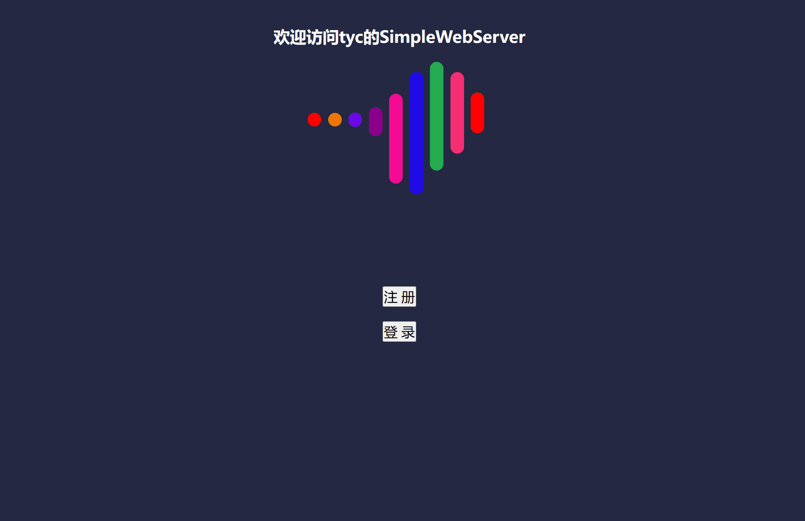

# SimpleWebServer

- 半同步半反应堆模式+同步模拟Proactor模式+Epoll IO多路复用+非阻塞IO
- 基于单例模式与循环阻塞队列实现异步日志系统
- 基于小顶堆实现了定时器容器类，处理非活动连接
- 设计了Mysql数据库连接池，基于RAII机制的提取和释放数据库连接
- 基于主从状态机解析HTTP请求报文，并实现了GET和POST方法的处理
- 经过Webbench压力测试可以实现10000+的QPS（服务环境为Linux，8G内存，i58300H）


# 环境要求

- mysql
- Linux
- c++11


# 工程修改

- 修改http_conn.cpp的doc_root

- mysql需要创建user表

  - ```mysql
    CREATE TABLE user(
        username char(50) NULL,
        passwd char(50) NULL
    )ENGINE=InnoDB;
    ```

- main.cpp 修改数据库连接池相关参数


# 效果

- 


# 参考

- Linux高性能服务器编程，游双著.